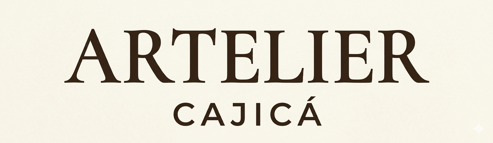

<a id="top"></a>

<p align="center">
  
</p>

<p align="center">
  
  
  
  
  
  
  
  
  
</p>

<p align="center">
  <b>REST API for Artelier Cajicá — an e-commerce platform for handmade ceramic and wood art.</b><br/>
  Built with Java 21 · Spring Boot · PostgreSQL · JWT · Cloudinary · Wompi
</p>

---

## Table of Contents

- [About the Project](#-about-the-project)
- [Tech Stack](#-stack-backend)
- [Architecture Overview](#-architecture-overview)
- [Testing](#-testing--quality)
- [Getting Started](#-getting-started)
- [Environment Variables](#-environment-variables)
- [Deploy](#-deployment--infrastructure)
- [Contributing](#-contributing)
- [License](#-license)
- [Author](#-author)

---

## 🎨 About the Project

**Artelier Cajicá** is a real handmade art brand based in Cajicá, Colombia. The brand sells
one-of-a-kind ceramic and wood sculptures — each piece hand-painted, some made entirely from
scratch using clay.

Up until now, sales have been mostly word-of-mouth. The artist has an Instagram account
([@arteliercajica](https://www.instagram.com/arteliercajica)) with 109 posts but limited reach.
This platform was built to solve that: a dedicated online store that showcases her work properly,
handles orders and payments, and gives her a real digital presence.

**What this project solves:**

- Replaces DM-based ordering with a structured shopping flow
- Handles mixed-inventory products — both in-stock pieces and made-to-order work
- Supports Colombian payment methods: Nequi, PSE, and card via **Wompi**
- Gives the artist an admin dashboard to manage products, orders, and media uploads
- Lays the groundwork for future content like process videos and workshop bookings

This is also a full-stack portfolio project demonstrating a production-grade architecture
with Spring Boot, JWT auth, Flyway migrations, Cloudinary integration, and CI/CD.

---

## 🚀 Stack Backend

| Layer | Technology |
|-------|------------|
| **Language** |  |
| **Frameworks** |    |
| **Persistence** |    |
| **Payments** |  |
| **Infrastructure** |    |
| **Utilities** |    |
| **Docs & Monitoring** |   |

---

## 🏗 Architecture Overview


The backend follows a layered architecture based on Spring Boot best practices:

- **Controller Layer** → Exposes REST endpoints (public and admin APIs)
- **Service Layer** → Contains business logic and application rules
- **Repository Layer** → Data access using Spring Data JPA
- **Entity Layer** → JPA domain models and database mappings
- **DTO Layer** → Request/response models for API communication
- **Mapper Layer** → MapStruct-based transformations between entities and DTOs
- **Security Layer** → JWT authentication, authorization filters and configurations
- **Exception Layer** → Centralized error handling and custom exceptions
- **Config Layer** → Application configuration (CORS, OpenAPI, Cloudinary, Cache, etc.)

### Package Structure

```
com.artelier.api
├── config          # Application configuration (OpenAPI, security, etc.)
├── controller      # REST controllers
├── dto             # DTOs, requests, responses and projections
│   ├── projection
│   ├── request
│   └── response
├── entity          # JPA entities
├── enums           # Shared application enums
├── exception       # Global exception handling
├── integration     # External service integrations
│   ├── cloudinary
│   │   ├── config
│   │   ├── dto
│   │   ├── exception
│   │   └── service
│   └── wompi
│       ├── config
│       ├── dto
│       ├── enums
│       ├── exception
│       ├── service
│       └── util
├── mapper          # MapStruct mappers
├── repository      # Data access layer
├── security        # JWT and Spring Security
└── service         # Business services
    └── impl        # Service implementations
```

---

## 🧪 Testing & Quality

### Testing Stack

<p align="center">
  
  
  
  
</p>

### Code Quality Metrics

<p align="center">
  
  
  
  
  
  
</p>

The project includes a **comprehensive automated test suite** covering both
**service and controller layers**, with coverage tracked via **JaCoCo**
and static analysis performed using **SonarCloud**.

### Running Tests

```bash
# Run all tests
./mvnw test

# Run with coverage report
./mvnw verify

# Open the coverage report
open target/site/jacoco/index.html
```

The JaCoCo report is generated at `target/site/jacoco/index.html` after running `mvn verify`.

---

## 🚀 Getting Started

### Prerequisites


### 1. Clone the repo

```bash
git clone https://github.com/MimiRandomS/artelier-api.git
cd artelier-api
```

### 2. Configure environment

```bash
cp .env.example .env
# Fill in your values — see Environment Variables section below
```

### 3. Start only the database

```bash
docker compose up -d db
```

This starts a PostgreSQL 16 container. Flyway runs automatically on app startup
and applies all migrations — no manual database setup required.

### 4. Run the API

```bash
./mvnw spring-boot:run
```

The API will be available at `http://localhost:8080`.  
Swagger UI: `http://localhost:8080/swagger-ui.html`

### 5. Full local stack with Docker

```bash
docker compose up -d
```

Builds the application image using the multi-stage `Dockerfile` and starts
both PostgreSQL and the Spring Boot app together. The API service overrides
`DB_HOST` internally to point to the `db` service, and disables `sslmode=require`
for local development.

> The `Dockerfile` uses a two-stage build: Maven compiles and packages the JAR
> in an isolated build stage, then the final image runs only the JRE — keeping
> the production image lean.

---

## ⚙️ Environment Variables

Copy `.env.example` and fill in the following:

```env
#################################
# APP
#################################
APP_NAME=artelier-api
SERVER_PORT=8080

#################################
# DATABASE
#################################
DB_HOST=localhost
DB_PORT=5432
DB_NAME=artelier
DB_USERNAME=postgres
DB_PASSWORD=postgres

#################################
# JWT
#################################
JWT_SECRET=change_this_to_a_very_long_secure_secret_key_123456
JWT_EXPIRATION_MS=900000           # 15 minutes
JWT_REFRESH_EXPIRATION_DAYS=7

#################################
# CLOUDINARY
#################################
CLOUDINARY_CLOUD_NAME=your_cloud_name
CLOUDINARY_API_KEY=your_api_key
CLOUDINARY_API_SECRET=your_api_secret

#################################
# CORS
#################################
CORS_ALLOWED_ORIGINS=http://localhost:3000,http://localhost:5173

#################################
# FLYWAY
#################################
FLYWAY_ENABLED=true

#################################
# JPA
#################################
JPA_DDL_AUTO=validate
JPA_SHOW_SQL=false

#################################
# SWAGGER
#################################
SWAGGER_ENABLED=true

#################################
# ACTUATOR
#################################
ACTUATOR_EXPOSE=health,info,metrics

#################################
# WOMPI
#################################
WOMPI_EVENTS_KEY=test_events_xxx
WOMPI_PUBLIC_KEY=pub_test_xxx
WOMPI_PRIVATE_KEY=priv_test_xxx
WOMPI_INTEGRITY_SECRET=test_integrity_xxx
WOMPI_BASE_URL=https://sandbox.wompi.co/v1
WOMPI_REDIRECT_URL=https://your-frontend.com/payment/result

#################################
# CAFFEINE CACHE
#################################
CAFFEINE_MAXIMUM_SIZE=500
CAFFEINE_EXPIRE_AFTER_WRITE=5m
```

> ⚠️ Never commit your real `.env`. It is already in `.gitignore`.

---

## ☁️ Deployment & Infrastructure

### Platforms

<p align="center">
  
  
  
  
</p>

### Live URLs

| Resource | URL |
|----------|-----|
| **API** | https://artelier-api-djt4.onrender.com |
| **Swagger UI** | https://artelier-api-djt4.onrender.com/swagger-ui.html |

### Deployment Notes

- **Backend:** Deployed on **Render** with automatic deploys from the `main` branch
- **Database:** Managed **Supabase PostgreSQL** instance
- **Frontend:** Will be hosted on **Vercel** — not yet deployed
- **Media Storage:** Images handled via **Cloudinary**

**Database migrations** are handled automatically by **Flyway** on application startup —
no manual database setup required beyond providing the connection variables.

> **Note:** Render free-tier instances spin down after inactivity.
> The first request after a cold start may take 30–60 seconds.

---

## 🤝 Contributing

This is a personal portfolio project, but feedback and suggestions are welcome.

1. Fork the repo
2. Create a feature branch: `git checkout -b feat/my-feature`
3. Commit your changes: `git commit -m 'feat: add my feature'`
4. Push and open a Pull Request

Please follow [Conventional Commits](https://www.conventionalcommits.org/) for commit messages.

---

## 📃 License

Distributed under the MIT License. See `LICENSE` for details.

---

## 👨‍💻 Author

<p align="center">
  
</p>

<p align="center">
  <b>Geronimo Martinez Nuñez</b><br/>
  Systems Engineering Student · Full Stack Developer
</p>

I focus on building scalable backend systems, distributed architectures, and real-world
applications that solve practical problems.

This project reflects my approach to backend development — designing clean, maintainable
APIs with proper architecture, security, and integration of external services.

### 🔧 What I work with

- Backend development (Java · Spring Boot)
- RESTful APIs and real-time systems
- Cloud-based architectures and deployment
- Automation workflows and AI-assisted solutions

### 🌐 Links

- GitHub: https://github.com/MimiRandomS

---

<p align="center">
  Built with ❤️ for <a href="https://www.instagram.com/arteliercajica">Artelier Cajicá</a> — handmade art from Cajicá, Colombia.
</p>

[Back to top](#top)
```